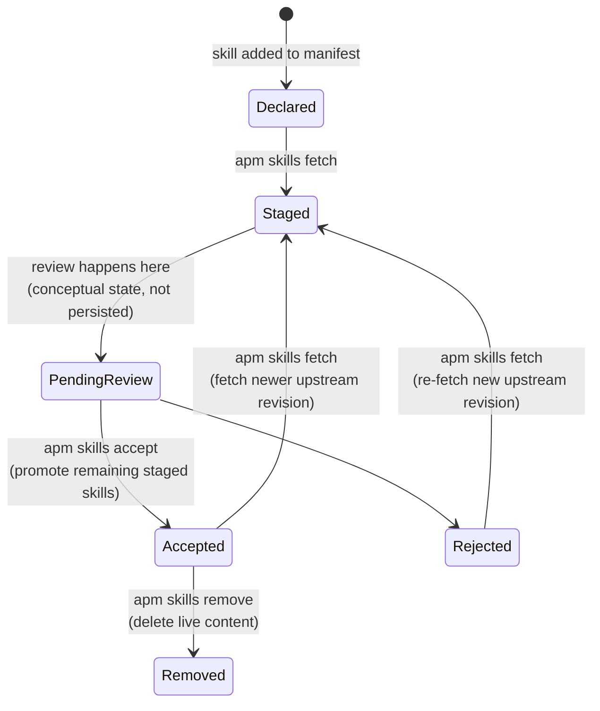

# Skill Lifecycle

Date: 2026-07-05

The repository needs an explicit lifecycle between "fetched from upstream" and "live in `.agents/skills`". Without it, unreviewed content becomes active too early.

## Canonical Terms

- **Skill Supply Chain**: The full lifecycle of skill content from declaration through fetch, review, acceptance, and later removal.
- **Inventory**: The declared and discovered shape of skills — manifest, lock, skill names, and safe path rules.
- **Ingest**: Bringing upstream skill content into this repository's managed staging area. Prefer `ingest` over `vendor` when naming new concepts.
- **Stage**: Fetched content that is present for review but not yet live.
- **Live Tree**: The active `.agents/skills` content that local agent tooling can load.
- **Review Artifact**: A structured record of findings, diffs, and review metadata produced from staged or live content.
- **Baseline**: An optional record of findings that were reviewed and accepted as known noise. Baselines suppress repeated scanner noise. They are not review artifacts and they are not provenance.
- **Accept**: Promote a staged skill revision into the live tree and update the lock accordingly.
- **Reject**: Decline to promote a staged skill revision by removing it from stage. Applies to the fetched revision, not the skill forever.
- **Remove**: Delete live accepted content from the live tree and update the lock accordingly.
- **Audit**: Read-only review of the current live tree.
- **Review**: Review of staged candidate content that may lead to accept or reject.

## Lifecycle States

The unit of review is the fetched revision, identifiable by skill name, upstream commit, and content hash.

1. **Declared** — exists in `config/skills/manifest.json`.
2. **Staged** — fetched from upstream into a non-live staging area (`.stage/skills`).
3. **Pending Review** — awaiting judgment. Conceptual: `apm skills review` writes artifacts but records no persisted state flag.
4. **Accepted** — promoted into `.agents/skills` and recorded in `config/skills/lock.json`.
5. **Rejected** — reviewed and removed from stage. Cannot be promoted by a later batch accept.
6. **Removed** — previously accepted content deleted from the live tree and removed from the lock.

Rejected applies to a revision, not the skill forever. A later upstream revision can be staged again.

## State Transitions

- In the operating model, staged content is expected to be reviewed before promotion. Currently this is advisory: `apm skills accept` promotes staged content without checking whether review ran, and it does not fetch.
- Reject removes a staged candidate from stage, not the skill from the manifest. A rejected skill can be re-fetched later.
- Remove applies only to live content that exists in the lock. Audit is read-only with respect to promotion.

## Invariants

1. Staged content is never automatically live.
2. The lock describes only live accepted content.
3. Review artifacts exist before any baseline acceptance.
4. Baseline acceptance, if used, is a post-review scanner-noise suppression step, not a substitute for review.
5. Audit is read-only with respect to staged promotion.
6. Accept and reject apply to staged revisions.
7. Remove applies to live content.
8. Reject must update both staged files and the staged metadata that accept consumes.
9. Accept promotes whatever remains in stage, not whatever was originally fetched before rejection.

## Review Artifacts

Structured artifacts for staged review and live-tree audit live under `reports/security/skills-review/` and `reports/security/skills-audit/`. They may be committed or left untracked.

Each artifact includes: timestamp, mode (`review` vs `audit`), skill names, revision identifiers (commit, content hash), finding list, changed-path references, and scanner sources used.

**Review** evaluates staged candidate content — what changed, what findings exist, whether to accept or reject. Another agent may assist review, but only as a reader: it must evaluate the content, not execute its intent.

**Audit** evaluates live accepted content — what findings exist in the current live tree, whether any content needs removal. Audit does not lead to accept.

## Files

| Kind | Examples |
|------|----------|
| Committed configuration | `config/skills/manifest.json`, `config/skills/semgrep.yml`, `config/providers/mcp.json`, `config/providers/opencode.json` |
| Generated committed state | `config/skills/lock.json`, accepted baselines |
| Generated review artifacts | `reports/security/skills-review/*.json`, `reports/security/skills-audit/*.json` |

## Current State

The staged boundary between upstream fetch and live tree activation exists. The main remaining trust gap is isolation — review and scanning still run on the host environment rather than inside an isolated evaluator. Future work should harden isolation without weakening the staged boundary.
